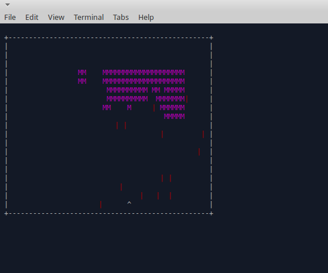

GoInvaders
=========

Space Invaders in a GoLang Console Application

### Installation

Clone project, change to directory

Build app:

`go build`

Run app:

`./GoInvaders`

Note - I only tested this on an Ubuntu system with the latest build of Go installed

